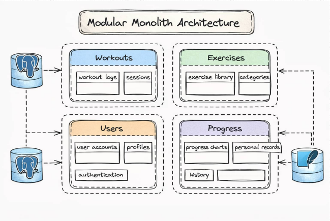

# Workout Logger — Project Description

Workout Logger app that helps users record
exercises, sets, and weights, then chart their
progress over time.

It turns raw training data into meaningful
charts and history logs, giving users a clear
picture of how they improve week after week.

## Business requirements:

* Record workout sessions with exercises, sets, reps, and weights
* Browse and manage an exercise catalog with muscle groups and categories
* Visualize progress over time with interactive charts
* Track personal records per exercis

## Progress Chart Requirement

* Smooth rendering at any data range: a week of data or a full year should display cleanly without layout breaks.
* Accurate and stable chart formatting on any screen size and device resolution
* High-quality rendering with crisp lines, labels, and axis values suitable for small and large screens.
* Multiple chart types: line charts for weight progress, bar charts for volume per session.
* Personal records highlighted directly on the chart for instant visual feedback.
* Fully cross-platform rendering that works on iOS, Android, and Windows from a single codebase.

## Tech Stack

### Backend:
ASP .NET 10 Web API, EF Core, hosted via .NET Aspire

### Frontend:
.NET MAUI cross-platform app using LiveChart

### Architecture:
Modular Monolit

### Database:
Postgres (server) + SQLite (local)

### Deployment:
.NET Aspire

### Architecture: Modular Monolith

* Workouts Module -> workout sessions, sets, reps, weights
* Exercises Module -> exercise catalog, muscle groups, categories
* Users Module -> user accounts, roles, authentication
* Progress Module -> progress tracking, charts, personal record

